# 基础功能实现
## 连接机器

1. 下载atrust，按账号密码登录
2. 连接host：`ssh -p 22 doca@192.168.102.1` 密码：`@doca`
3. 在host中打开一个terminal连接dpu：`ssh -p 22 ubuntu@192.168.100.2` 密码：`@doca`

<figure style="display: inline-block; margin-right: 10px; text-align: center;">
    
    <figcaption>A terminal on Host connected to dpu</figcaption>
</figure>
<figure style="display: inline-block; text-align: center;">
    
    <figcaption>A terminal on Host</figcaption>
</figure>

## 编译secure channel

1. 切换到根目录
    ```shell
    sudo -i
    cd /
    ```
2. 编译
    ```shell
    cd /opt/mellanox/doca/applications/
    meson /tmp/build -Denable_all_applications=false Denable_secure_channel=true
    ninja -C /tmp/build
    ```
3. 在host和dpu都要完成编译

## 运行

1. 找到编译好的secure channel的位置
    ```shell
    # 在host和dpu上位置是一样的
    cd /
    cd /tmp/build/secure_channel/
    # 查看help
    ./doca_secure_channel -h
    ```

2. 在dpu上运行应用
    ```shell
    # 进入host上连接dpu的shell
    # Check Device PCI Address and Device Representor PCI Address
    doca_caps --list-rep-devs
    # Device PCI Address: 03:00.0
    # Device Representor PCI Address: b1:00.0
    ./doca_secure_channel -s 256 -n 10 -p 03:00.0 -r b1:00.0
    # Started Listening, waiting for new connection
3. 在host上运行应用
    ```shell
    # 进入host本身的shell
    # Check Device PCI Address
    lspci | grep Mellanox
    # Device PCI Address: 03:00.0
    ./doca_secure_channel -s 256 -n 10 -p 03:00.0 
    # Connection to DPU was established successfully

## 更改源代码以打印消息

- 源代码位于：
    ```shell
    cd /
    cd /opt/mellanox/doca/applications/secure_channel/
    # secure_channel_core.c
    ```
- 改完源代码之后要重新编译

<figure style="text-align: center;">
  
  <figcaption>DPU received messages</figcaption>
</figure>

<figure style="text-align: center;">
  
  <figcaption>Host sent messages</figcaption>
</figure>


# 功能一：使用json文件来导入configuration
使用json文件替换命令行来输入指令

## 实现思路
使用json来输入文件的功能在提供的代码中已经实现，具体来说，命令行解析代码在`secure_channel/secure_channel.c`的57-74行。
1. 首先，调用`<doca_argp.h>`库的`doca_argp_init`函数。通过注册程序名称（在这里是"doca_secure_channel"）和程序参数初始化argp模块
    
    函数参数如下:
    ```c
    doca_error_t doca_argp_init(const char *program_name, void *program_config);
    ```
    在secure_channel中的调用如下：
    ```c
    result = doca_argp_init("doca_secure_channel", &app_cfg);
	if (result != DOCA_SUCCESS) {
		DOCA_LOG_ERR("Failed to init ARGP resources: %s", doca_error_get_descr(result));
		return EXIT_FAILURE;
	}
    ```
2. 使用`secure_channel/secure_channel_core.c`中创建的`register_secure_channel_params`函数设置argp参数
   
    - 函数原型如下，一共设置了4个参数：
      - message_size_param，规定了传送的数据大小，
      - num-msgs 规定了传输的次数
      - pci-addr 指定Device PCI地址
      - rep-pci 指定Device Representor PC 地址
    ```c
    doca_error_t register_secure_channel_params(void)
    {
        doca_error_t result;

        struct doca_argp_param *message_size_param, *messages_number_param, *pci_addr_param, *rep_pci_addr_param;

        /* Create and register message to send param */
        result = doca_argp_param_create(&message_size_param);
        if (result != DOCA_SUCCESS) {
            DOCA_LOG_ERR("Failed to create ARGP param: %s", doca_error_get_descr(result));
            return result;
        }
        doca_argp_param_set_short_name(message_size_param, "s");
        doca_argp_param_set_long_name(message_size_param, "msg-size");
        doca_argp_param_set_description(message_size_param, "Message size to be sent");
        doca_argp_param_set_callback(message_size_param, message_size_callback);
        doca_argp_param_set_type(message_size_param, DOCA_ARGP_TYPE_INT);
        doca_argp_param_set_mandatory(message_size_param);
        result = doca_argp_register_param(message_size_param);
        if (result != DOCA_SUCCESS) {
            DOCA_LOG_ERR("Failed to register program param: %s", doca_error_get_descr(result));
            return result;
        }

        /* Create and register number of message param */
        result = doca_argp_param_create(&messages_number_param);
        if (result != DOCA_SUCCESS) {
            DOCA_LOG_ERR("Failed to create ARGP param: %s", doca_error_get_descr(result));
            return result;
        }
        doca_argp_param_set_short_name(messages_number_param, "n");
        doca_argp_param_set_long_name(messages_number_param, "num-msgs");
        doca_argp_param_set_description(messages_number_param, "Number of messages to be sent");
        doca_argp_param_set_callback(messages_number_param, messages_number_callback);
        doca_argp_param_set_type(messages_number_param, DOCA_ARGP_TYPE_INT);
        doca_argp_param_set_mandatory(messages_number_param);
        result = doca_argp_register_param(messages_number_param);
        if (result != DOCA_SUCCESS) {
            DOCA_LOG_ERR("Failed to register program param: %s", doca_error_get_descr(result));
            return result;
        }

        /* Create and register Comm Channel DOCA device PCI address */
        result = doca_argp_param_create(&pci_addr_param);
        if (result != DOCA_SUCCESS) {
            DOCA_LOG_ERR("Failed to create ARGP param: %s", doca_error_get_descr(result));
            return result;
        }
        doca_argp_param_set_short_name(pci_addr_param, "p");
        doca_argp_param_set_long_name(pci_addr_param, "pci-addr");
        doca_argp_param_set_description(pci_addr_param, "DOCA Comm Channel device PCI address");
        doca_argp_param_set_callback(pci_addr_param, dev_pci_addr_callback);
        doca_argp_param_set_type(pci_addr_param, DOCA_ARGP_TYPE_STRING);
        doca_argp_param_set_mandatory(pci_addr_param);
        result = doca_argp_register_param(pci_addr_param);
        if (result != DOCA_SUCCESS) {
            DOCA_LOG_ERR("Failed to register program param: %s", doca_error_get_descr(result));
            return result;
        }

        /* Create and register Comm Channel DOCA device representor PCI address */
        result = doca_argp_param_create(&rep_pci_addr_param);
        if (result != DOCA_SUCCESS) {
            DOCA_LOG_ERR("Failed to create ARGP param: %s", doca_error_get_descr(result));
            return result;
        }
        doca_argp_param_set_short_name(rep_pci_addr_param, "r");
        doca_argp_param_set_long_name(rep_pci_addr_param, "rep-pci");
        doca_argp_param_set_description(rep_pci_addr_param,
                        "DOCA Comm Channel device representor PCI address (needed only on DPU)");
        doca_argp_param_set_callback(rep_pci_addr_param, rep_pci_addr_callback);
        doca_argp_param_set_type(rep_pci_addr_param, DOCA_ARGP_TYPE_STRING);
        result = doca_argp_register_param(rep_pci_addr_param);
        if (result != DOCA_SUCCESS) {
            DOCA_LOG_ERR("Failed to register program param: %s", doca_error_get_descr(result));
            return result;
        }

        /* Register version callback for DOCA SDK & RUNTIME */
        result = doca_argp_register_version_callback(sdk_version_callback);
        if (result != DOCA_SUCCESS) {
            DOCA_LOG_ERR("Failed to register version callback: %s", doca_error_get_descr(result));
            return result;
        }

        return DOCA_SUCCESS;
    }
    ```
   
    - 在secure_channel中的调用如下：
    ```c
    result = register_secure_channel_params();
    if (result != DOCA_SUCCESS) {
        DOCA_LOG_ERR("Failed to parse register application params: %s", doca_error_get_descr(result));
        doca_argp_destroy();
        return EXIT_FAILURE;
    }
    ```
    
3. 最后，调用`<doca_argp.h>`库的`doca_argp_start`函数解析命令行参数，如果参数中有`--json`，doca_argp_start可以自动识别
   
   ```c
	result = doca_argp_start(argc, argv);
	if (result != DOCA_SUCCESS) {
		DOCA_LOG_ERR("Failed to parse application input: %s", doca_error_get_descr(result));
		doca_argp_destroy();
		return EXIT_FAILURE;
	}
   ```
   

## 功能演示
1. 在BlueField上写json文件:
    ```shell
    $ cd /tmp/build/secure_channel # 找到编译好的代码位置
    $ vim sc_params.json           # 打开一个空的json文件
    ```
    在vim中写入：
    ```vim
    {
        "doca_general_flags": {
            "log-level": 60
        },
        "doca_program_flags": {
            "msg-size": 128,
            "num-msgs": 10,
            "pci-addr": "03:00.0",
            "rep-pci": "b1:00.0"
        }
    }
    ```
    这个json文件可以实现传输10条信息，每条信息传输128字节
2. 在BlueField上开启server
    ```shell
    $ ./doca_secure_channel --json sc_params.json
    ```
    效果如下：
<figure style="text-align: center;">
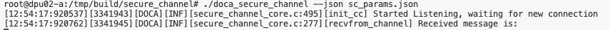
<figcaption>DPU server start by json file</figcaption>
</figure>


3. 在host上写json文件:
    ```shell
    $ cd /tmp/build/secure_channel # 找到编译好的代码位置
    $ vim sc_params.json           # 打开一个空的json文件
    ```
    在vim中写入：
    ```vim
    {
        "doca_general_flags": {
            "log-level": 60
        },
        "doca_program_flags": {
            "msg-size": 128,
            "num-msgs": 10,
            "pci-addr": "03:00.0",
            "rep-pci": "b1:00.0"
        }
    }
    ```
4. 在host上发送数据
    ```shell
    $ ./doca_secure_channel --json sc_params.json
    ```
    效果如下：
<figure style="text-align: center;">
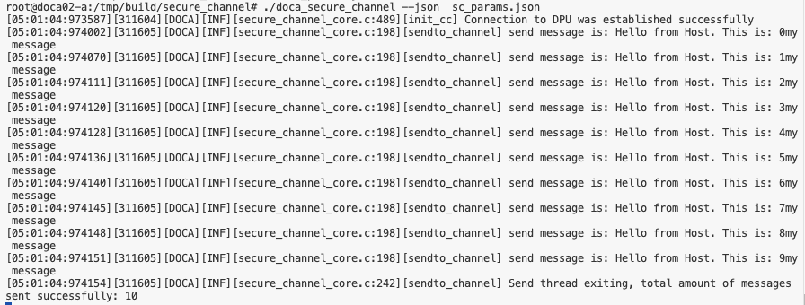
<figcaption>host send messages through json configuration</figcaption>
</figure>

<figure style="text-align: center;">
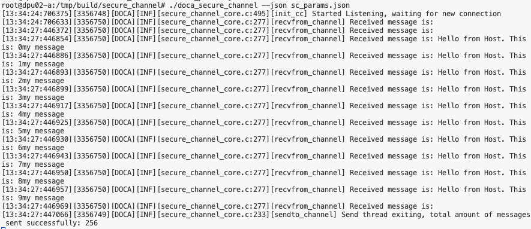
<figcaption>dpu received messages</figcaption>
</figure>

# 功能二：支持host发送两个数字到dpu，并由dpu进行加法计算，输出结果到命令行

## 实现思路
1. 更改数据结构。在sc_config中新加入两个int类型的成员变量`a`和`b`。
2. 通过`register_secure_channel_params`函数注册新的命令行参数：被加数`--augend`和加数`--addend`，分别对应sc_config中的a和b。
3. 修改`sendto_channel`函数，将a和b写入send_buffer，并通过secure channel传递给DPU。
4. 修改`recvfrom_channel`函数，接收send_buffer，并通过`my_add`函数解析为a和b，然后再相加，并把结果打印。

## 功能演示
1. `$ ./doca_secure_channel -h` 显示目前可以接收的命令行参数，可以看到新增了a和b。

<figure style="text-align: center;">
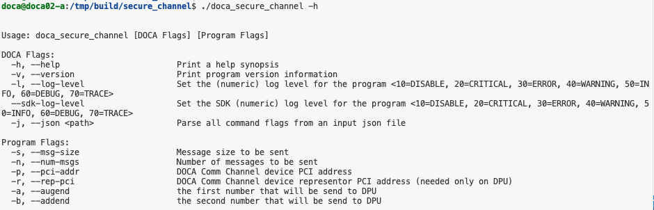
<figcaption>show exist flags</figcaption>
</figure>

2. 在Bluefield运行指令`$ ./doca_secure_channel -s 256 -n 10 -p 03:00.0 -r b1:00.0`，启动server
   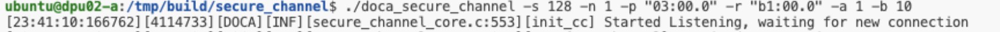
3. 在host命令行运行指令`$ ./doca_secure_channel -s 256 -n 10 -p 03:00.0 -r b1:00.0 -a 1 -b 10`，host传入两个数a=1和b=10给dpu。此时Bluefield上会显示传送过来的数据，并求和
<figure style="text-align: center;">
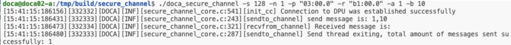
<figcaption>host send a=1, b=10</figcaption>
</figure>


<figure style="text-align: center;">
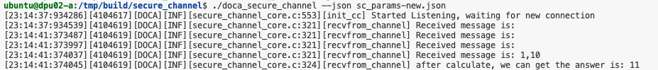
<figcaption>dpu received a=1, b=10, and get a+b=11</figcaption>
</figure>


4. 我们还可以多尝试几个不同的输入。可以看到无论a和b取任何值，都可以通过secure_channel传送到dpu，并完成计算。
<figure style="text-align: center;">
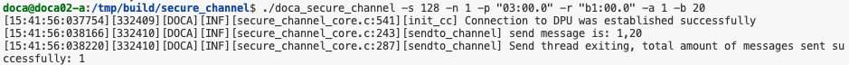
<figcaption>host send a=1, b=20</figcaption>
</figure>

<figure style="text-align: center;">
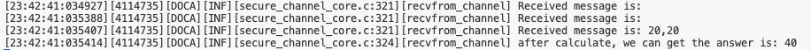
<figcaption>dpu received a=1, b=20, and get a+b=11</figcaption>
</figure>

<figure style="text-align: center;">
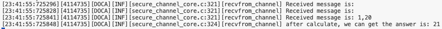
<figcaption>host send a=20, b=20</figcaption>
</figure>


<figure style="text-align: center;">
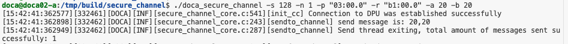
<figcaption>dpu received a=20, b=20, and get a+b=11</figcaption>
</figure>


