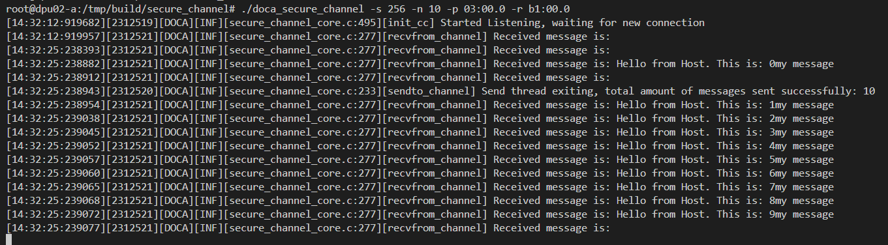
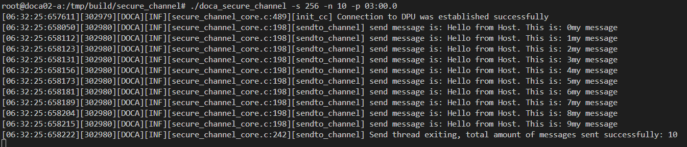

# 连接机器

1. 下载atrust，按账号密码登录
2. 连接host：`ssh -p 22 doca@192.168.102.1` 密码：`@doca`
3. 在host的命令行连接dpu：`ssh -p 22 ubuntu@192.168.100.2` 密码：`@doca`

# 编译secure channel(已完成)

1. 切换到根目录
    ```shell
    sudo -i
    cd /
    ```
2. 编译
    ```shell
    cd /opt/mellanox/doca/applications/
    meson /tmp/build -Denable_all_applications=false Denable_secure_channel=true
    ninja -C /tmp/build
    ```
3. 在host和dpu都要完成编译

# 运行

1. 找到编译好的secure channel的位置
    ```shell
    # 在host和dpu上位置是一样的
    cd /
    cd /tmp/build/secure_channel/
    # 查看help
    ./doca_secure_channel -h
    ```

2. 在dpu上运行应用
    ```shell
    # 进入host上连接dpu的shell
    # Check Device PCI Address and Device Representor PCI Address
    doca_caps --list-rep-devs
    # Device PCI Address: 03:00.0
    # Device Representor PCI Address: b1:00.0
    ./doca_secure_channel -s 256 -n 10 -p 03:00.0 -r b1:00.0
    # Started Listening, waiting for new connection
3. 在host上运行应用
    ```shell
    # 进入host本身的shell
    # Check Device PCI Address
    lspci | grep Mellanox
    # Device PCI Address: 03:00.0
    ./doca_secure_channel -s 256 -n 10 -p 03:00.0 
    # Connection to DPU was established successfully

# 更改源代码以打印消息（已完成）

- 源代码位于：
    ```shell
    cd /
    cd /opt/mellanox/doca/applications/secure_channel/
    # secure_channel_core.c
    ```
- 改完源代码之后要重新编译

<figure style="text-align: center;">
  
  <figcaption>DPU received messages</figcaption>
</figure>

<figure style="text-align: center;">
  
  <figcaption>Host sent messages</figcaption>
</figure>