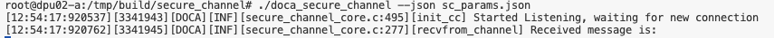
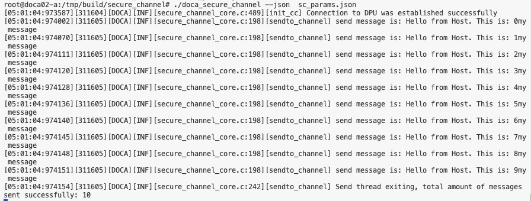
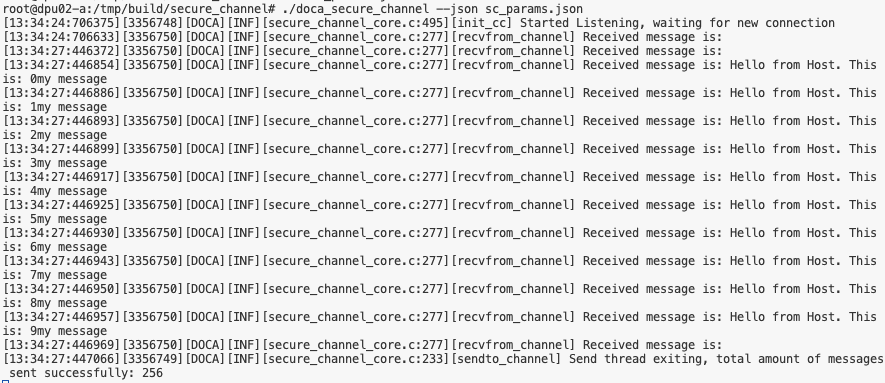
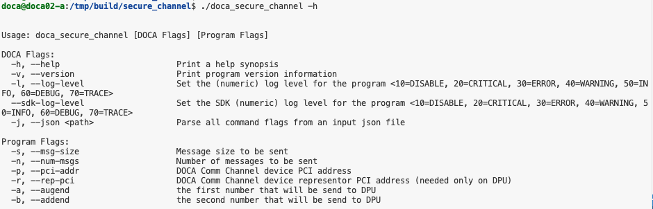
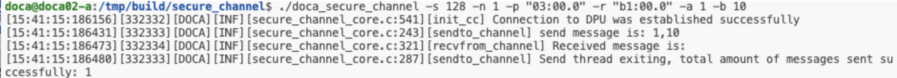
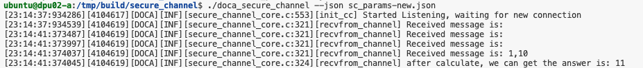
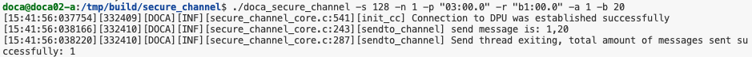
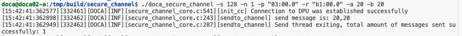

# NVIDIA DOCA Secure Channel 实验报告

## 1. 实验概述

现代数据中心分为三大支柱，即CPU、GPU、DPU。其中CPU负责单线程地执行通用计算任务、GPU可以大规模并行执行计算任务、DPU专门设计来加速数据密集型计算。DPU的出现能够将基础设施任务从CPU上卸载，并加速其运行速度，同时起到隔离各个区域，保护用户数据安全的作用。

本实验基于 **NVIDIA DOCA SDK**，旨在探索并实现 **Host**（主机）与 **DPU**（数据处理单元）之间的安全通信通道。实验的核心目标是通过使用 **DOCA Comm Channel APIs** 构建一个安全通道，确保数据在主机与DPU之间的可靠传输。此外，我们还计划扩展基本功能，支持更加复杂的数据交换和计算任务。

具体实验目标包括：
1. 理解并使用 **DOCA Comm Channel APIs** 创建安全通道，确保Host和DPU之间的高效和安全的数据通信。
2. 扩展功能一，通过 **JSON 配置文件** 来灵活配置通信参数，即使用json文件来导入configuration
3. 扩展功能二，为DPU开发简单的计算服务，支持host发送两个数字到dpu，并由dpu进行加法计算，输出结果到命令行

本报告将详细介绍实验的实施过程，包括实验环境搭建、基础功能实现、功能扩展、实验结果展示等内容，并总结实验成果与未来的改进方向。

## 2. 实验环境搭建

### 2.1 连接机器

1. 下载atrust，按账号密码登录
2. 连接host：`ssh -p 22 doca@192.168.102.1` 密码：`@doca`
3. 在host中打开一个terminal连接dpu：`ssh -p 22 ubuntu@192.168.100.2` 密码：`@doca`

<figure style="display: inline-block; margin-right: 10px; text-align: center;">
    
    <figcaption>A terminal on Host connected to dpu</figcaption>
</figure>
<figure style="display: inline-block; text-align: center;">
    
    <figcaption>A terminal on Host</figcaption>
</figure>


**DOCA SDK** 是NVIDIA为其数据处理单元（DPU）平台提供的一套开发工具包，旨在帮助开发者高效地开发、调试、部署基于DPU的加速应用。DOCA SDK包含多个功能模块，涵盖了从硬件加速到网络通信、数据处理、安全等各个方面。在本实验中，我们主要使用了 **DOCA Comm Channel**，它提供了创建和管理 Host 和 DPU 之间安全通信通道的能力。

### 2.2 编译准备

1. 切换到根目录
    ```shell
    sudo -i
    cd /
    ```
2. 编译
    ```shell
    cd /opt/mellanox/doca/applications/
    meson /tmp/build -Denable_all_applications=false -Denable_secure_channel=true
    ninja -C /tmp/build
    ```
3. 在host和dpu都需要完成编译

## 3. 基础功能实现

### 3.1 运行应用程序

**DOCA Comm Channel** 是 DOCA SDK 中用于实现通信的模块，它支持 Host 和 DPU 之间的数据传输。在本实验中，我们利用 DOCA Comm Channel 创建了一个安全的通信通道，确保数据在主机与 DPU 之间能够可靠、安全地传输。通过该通道，主机可以向 DPU 发送消息，DPU 可以对消息进行处理，并将结果返回给主机。


1. 定位编译好的secure channel
    ```shell
    cd /tmp/build/secure_channel/
    ./doca_secure_channel -h  # 查看帮助
    ```

2. DPU端运行
    ```shell
    # 检查设备PCI地址
    doca_caps --list-rep-devs
    # Device PCI Address: 03:00.0
    # Device Representor PCI Address: b1:00.0
    ./doca_secure_channel -s 256 -n 10 -p 03:00.0 -r b1:00.0
    ```

3. Host端运行
    ```shell
    # 检查设备PCI地址
    lspci | grep Mellanox
    # Device PCI Address: 03:00.0
    ./doca_secure_channel -s 256 -n 10 -p 03:00.0 
    ```

### 3.2 基础通信效果展示

<figure style="text-align: center;">
  
  <figcaption>DPU received messages</figcaption>
</figure>

<figure style="text-align: center;">
  
  <figcaption>Host sent messages</figcaption>
</figure>

## 4. 功能扩展

### 4.1 JSON配置文件支持

在本实验中，我们通过 **DOCA Argp** 库实现了 JSON 配置文件的支持。**DOCA Argp** 是 DOCA SDK 中用于命令行参数解析的模块，它支持用户通过 JSON 文件灵活地配置应用程序的各种参数。在此基础上，我们为通信通道的设置提供了更为友好的配置方式，使得用户能够轻松调整传输参数（如消息大小、消息数量、PCI 地址等）。


#### 4.1.1 实现原理

利用DOCA提供的`doca_argp.h`库实现JSON配置支持，主要包括：

1. `doca_argp_init`：初始化argp模块
2. `register_secure_channel_params`：注册参数
3. `doca_argp_start`：解析命令行参数，支持JSON文件输入

#### 4.1.2 使用演示

1. 创建JSON配置文件：
```json
{
    "doca_general_flags": {
        "log-level": 60
    },
    "doca_program_flags": {
        "msg-size": 128,
        "num-msgs": 10,
        "pci-addr": "03:00.0",
        "rep-pci": "b1:00.0"
    }
}
```

2. DPU端运行效果：

<figure style="text-align: center;">

<figcaption>DPU server start by json file</figcaption>
</figure>

3. Host端运行效果：

<figure style="text-align: center;">

<figcaption>host send messages through json configuration</figcaption>
</figure>

<figure style="text-align: center;">

<figcaption>dpu received messages</figcaption>
</figure>

### 4.2 DPU加法计算服务
支持host发送两个数字到dpu，并由dpu进行加法计算，输出结果到命令行

#### 4.2.1 实现方案

1. 扩展数据结构：在sc_config中添加a和b变量
2. 新增命令行参数：`--augend`和`--addend`
3. 修改数据传输逻辑，实现加法运算

#### 4.2.2 功能演示

1. 查看新增参数：

<figure style="text-align: center;">

<figcaption>show exist flags</figcaption>
</figure>

2. 运行测试：

- 测试用例1：a=1, b=10
<figure style="text-align: center;">

<figcaption>host send a=1, b=10</figcaption>
</figure>

<figure style="text-align: center;">

<figcaption>dpu received a=1, b=10, and get a+b=11</figcaption>
</figure>

- 测试用例2：a=1, b=20
<figure style="text-align: center;">

<figcaption>host send a=1, b=20</figcaption>
</figure>

<figure style="text-align: center;">

<figcaption>dpu received a=1, b=20, and get a+b=21</figcaption>
</figure>

- 测试用例3：a=20, b=20
<figure style="text-align: center;">

<figcaption>host send a=20, b=20</figcaption>
</figure>

<figure style="text-align: center;">

<figcaption>dpu received a=20, b=20, and get a+b=40</figcaption>
</figure>

## 5. 总结与展望

### 5.1 实验成果
1. 成功运行基本功能，基于DOCA SDK的安全通道通信
2. 完成JSON配置支持和DPU加法计算服务两个功能扩展
3. 体验DOCA框架在Host-DPU通信中的实用性

### 5.2 改进方向
1. 支持更复杂的数据结构传输
2. 增强错误处理机制
3. 优化性能和资源使用
4. 扩展更多计算功能

# Appendix
分工情况：
- 李鹏宇：负责实现基础功能，并完成对应部分的程序文档（`README.md`的`基础功能实现`部分）
- 李沐遥：负责实现拓展功能一和拓展功能二，并完成对应部分的程序文档（`README.md`的`功能一`和`功能二`两部分）
- 刘明灏：探索其他direction的实现方法，并辅助实现目标功能，撰写实验报告
- 李伟涛：探索其他direction的实现方法，并辅助实现目标功能，撰写实验报告